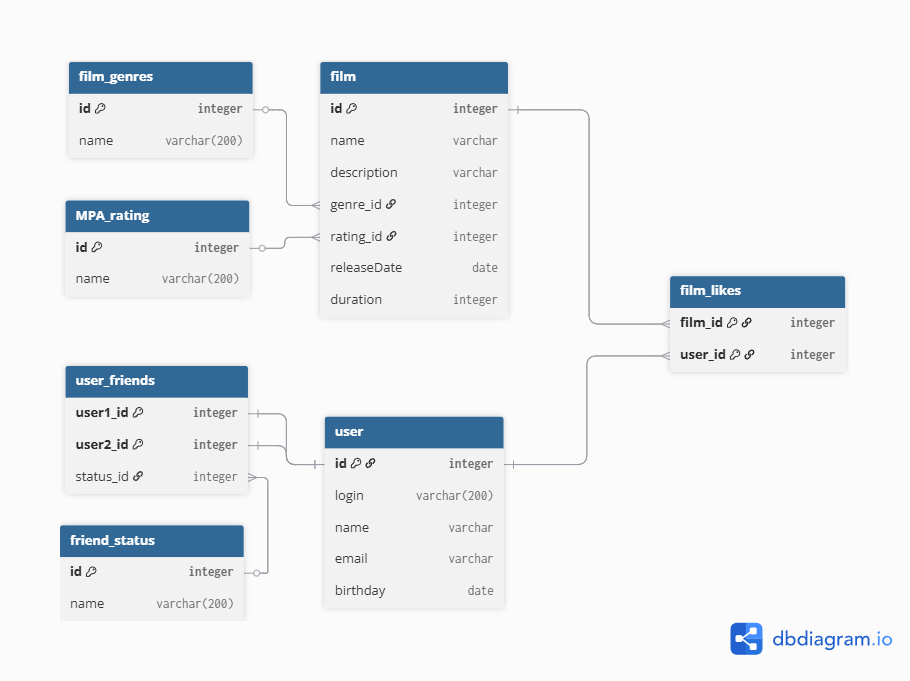

# java-filmorate
Template repository for Filmorate project.

**Схема базы данных**  


Примеры запросов
1) Список 10 наиболее популярных фильмов  
    ```sql
   SELECT f.film_id,
   f.name,
   f.description,
   f.release_date,
   f.duration_in_minutes,
   m.name               AS mpa_rating,
   GROUP_CONCAT(g.name) AS genres
   FROM films f
   JOIN mpa_ratings m ON f.mpa_id = m.mpa_id
   LEFT JOIN film_genres fg ON f.film_id = fg.film_id
   LEFT JOIN genres g ON fg.genre_id = g.genre_id
   GROUP BY f.film_id, f.name, f.description, f.release_date, f.duration_in_minutes, m.name
   ORDER BY f.film_id;
   ```

2) Получить все фильмы
    ```sql
   SELECT *
   FROM films
   ```

3) Список фильмов с рейтингом PG-13  
   ```sql
   SELECT f.name,  
   FROM film AS f  
   LEFT OUTER JOIN mpa_ratings AS r ON f.rating_id = r.id  
   WHERE r.name = 'PG-13'
   ```
4) Получить список пользователей
   ```sql
   SELECT *
   FROM users;
   ```